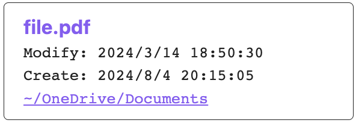
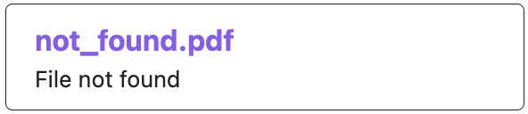
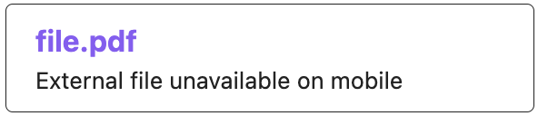
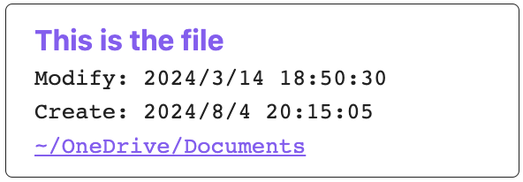

# External File Card Plugin

External File Card is a plugin for [Obsidian](https://obsidian.md). It shows a card displaying basic information of a file in pre-defined folders.

## How to use?

### Code block card

This plugin add two Markdown codeblock languages `ef` and `extfile`, which are equivalent. When provided with a file name or partial file path, this plugin will try to locate the given file in the file system, rooting from paths as given in the setting of this plugin. If a file is found, this plugin will render a card UI with its file name, modified and created times, and containing folder path. Both the file name and the containing folder path are clickable, opening the file and the folder using OS default applications.

For example, the following code block
~~~
```ef
file.pdf
```
~~~
will be rendered as
<br /><br />
if there is a file `~/OneDrive/Documents/file.pdf`.

If the file cannot be found, the following code block
~~~
```ef
not_found.pdf
```
~~~
will be rendered as
<br />

If the note is opened on mobile platforms, this plugin will not try to locate the file, but instead render the following card
<br />

### Inline file link

If instead of a card, an inline link is required, this plugin also handles Obsidian URIs in the format of `obsidian://ef#file.pdf` and `obsidian://extfile#file.pdf`. Note that the hash `#` cannot be omitted, and the file name or partial path should follow the hash. Additionally, spaces in file names should be encoded with `%20`, e.g., `obsidian://ef#a%20file.pdf` for `a file.pdf`.

These two URIs work similar to other URLs, i.e., you can use syntax like `[This is the file](obsidian://ef#file.pdf)` to create a link to the external file. Clicking on the link will open the file with the default application.

Similar to code block cards, the link won't do anything on mobile platforms.

### Insert code block card or inline file link by command

You can first copy-paste / type the file name in the Obsidian editor and select it. Then use `Insert external file card` command to surround it with `ef` code block, or `Insert external file link` command to transform it into `[file.pdf](obsidian://ef#file.pdf)`. The latter command also automatically encodes the file name to make it a valid URI.

## Where are the files?

In the setting panel, this plugin defines an `External paths` config item, which is an editable text area. You can list one or multiple root paths for the plugin to search for files.

For example, the following config
```
~/OneDrive/Documents
```
will let the plugin to glob all files by `~/OneDrive/Documents/**/file.pdf` with `~` expanded if `file.pdf` is provided in an `ef` or `extfile` code block. The first globbed file is shown.

If the following config is used
```
~/OneDrive/Documents
~/OneDrive
```
this plugin will first glob `~/OneDrive/Documents/**/file.pdf`. If nothing is found, the second line is used, i.e., `~/OneDrive/**/file.pdf`.

Indeed, this plugin just use string concatenation to construct the glob pattern. Therefore,
~~~
```ef
Documents/file.pdf
```
~~~
will lead to the glob `~/OneDrive/Documents/**/Documents/file.pdf` with config
```
~/OneDrive/Documents
```

## Can I show text other than the file name in the card?

By adding a vertical bar `|` and displayed text, the first line in the card can be customized.

For example, the following code block
~~~
```ef
file.pdf|This is the file
```
~~~
will be rendered as
<br />

## Why is there a plugin like this?

This plugin is primarily for my personal use case. I have many document files stored in the cloud (OneDrive for me), which is outside of the note vault. I design this plugin to make these files accessible within Obsidian across my multiple devices.

However, I believe this plugin may have many other use cases than mine. They are up to you to explore.